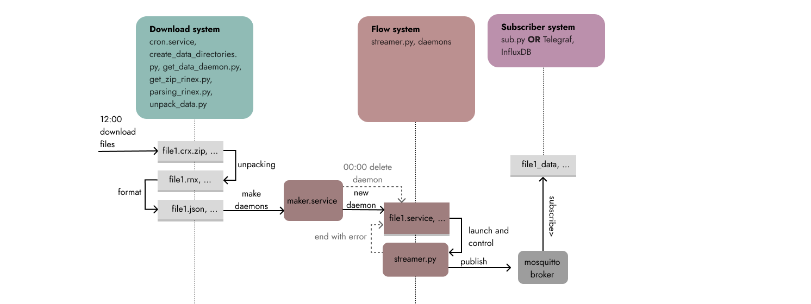

# О системе
Система состоит из загрузчика данных, сервера, имитирующего поток данных в реальном времени, брокера и клиента.


# Ресурсы и ограниченя

Ресурсы для реализации проекта включают в себя Python версии 3.8 и выше с дополнительными библиотеками: 
*	time – для поддержания синхронизации потоков со временем получения данных;
*	paho-mqtt==1.6.1 – для реализации mqtt-протокола между клиентом и сервером;
*	sys – для автоматического запуска потоков с помощью сервисов;
*	os, wget – для автоматической загрузки и сохранения файлов; 
*	zipfile, gzip, rnx, shutil, json  – для приведения загруженных файлов в нужный формат;
Полный перечень зависимостей содержится в файле requirements.txt. 
```
    pip install requirements.txt
```
Брокер mosquitto требует публичный сервер для получения доступа с любого устройства. Если необходимости в таком доступе нет, то сервер должен находиться в одной сети с клиентами. Брокер потребляет в среднем 30МБ оперативной памяти.

Клиенты для подписки могут использовать скрипт Python или пользоваться агентом сбора данных Telegraf в соединении с InfluxDB – базой данных, для хранения временных рядов, требующими минимально 200Мб для размещения на сервере.

Основное ограничение в работе программы: скрипт скачивает файлы четырехдневной давности, соответстввнно поток идет с опозданием на 4 дня. 

# Сценарий нормальной работы системы:
1.	В 12:00 начинаем загрузку файлов;
2.	Разархивируем файлы, переводим из CRX в RNX;
3.	Переформатируем файлы в формат json;
4.	Для каждого файла создаем свой демон-обработчик, имена демонов совпадают с именами файлов;
5.	Демоны запускают и контролируют скрипт отправителя данных, если скрипт заканчивает работу с ошибкой – перезапускают его;
6.	Отправитель шлет данные каждой станции в своем потоке;
7.	Брокер принимает данные;
8.	Подписчик авторизуется и получает данные из брокера;
9.	В 00:00 старые демоны удаляются и создаются заново, для новых файлов

# cron setings to get data

comand 
~/$ crontab -e

text for cron
24 20 * * * cd /home/evgeniy/PycharmProjects/Rinex_data/Get_data && python3 get_data_demon.py
